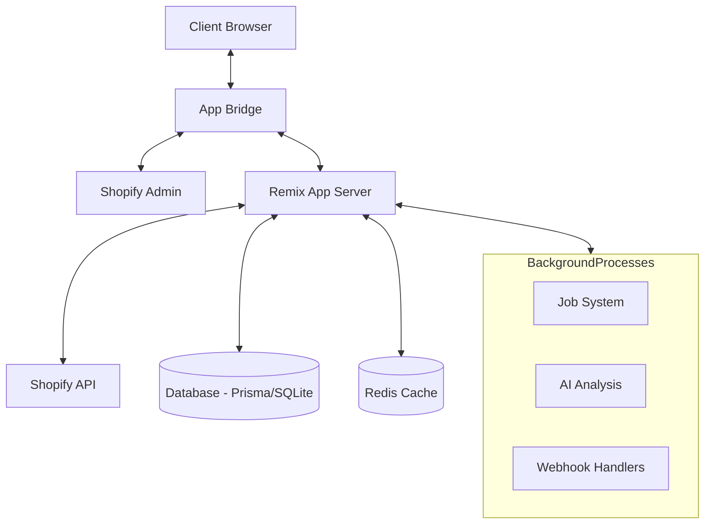
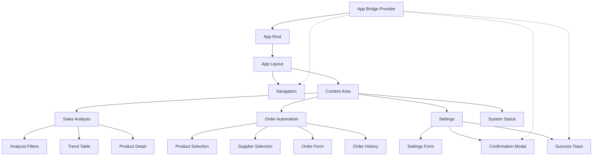
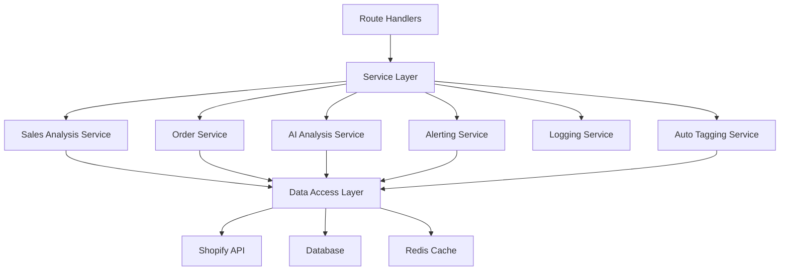
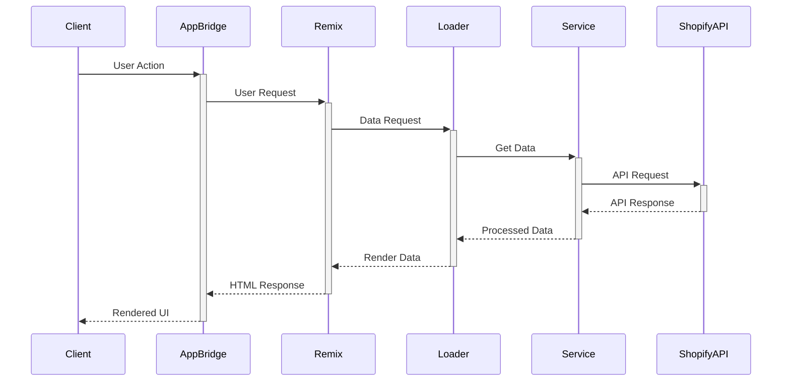
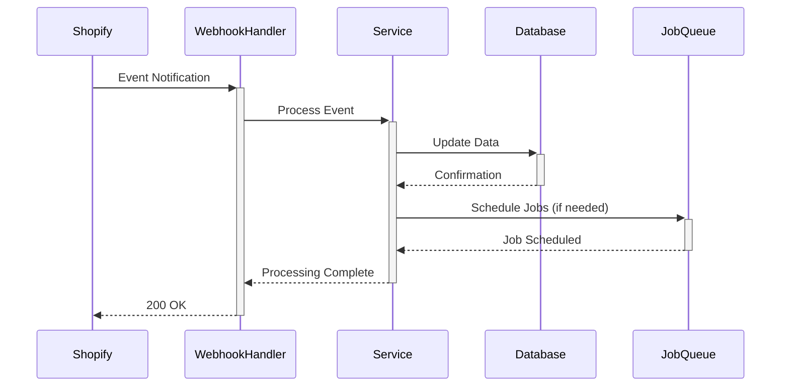
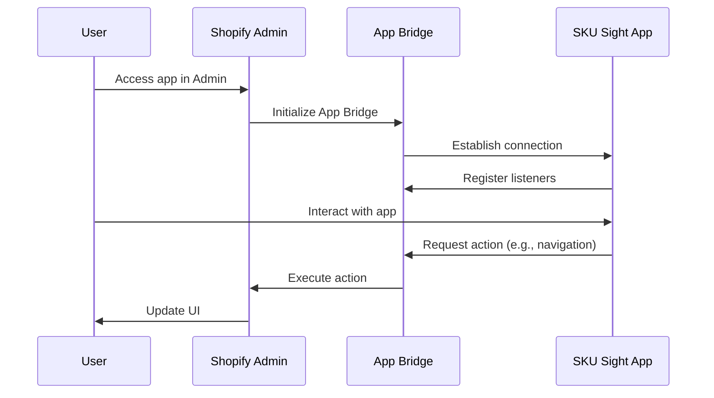

# System Patterns: SKU Sight

## System Architecture

### Overview
SKU Sight follows a modern web application architecture built on the Remix framework for Shopify apps. The application uses a client-server model with React for the frontend and Node.js for the backend, all integrated with Shopify's APIs and infrastructure. As an embedded Shopify app, it leverages App Bridge for seamless integration with the Shopify Admin.

### Key Components
1. **Frontend Layer**
   - React components organized by feature
   - Polaris design system for UI consistency
   - App Bridge for Shopify Admin integration
   - Client-side state management
   - Responsive layouts for all device sizes

2. **Application Layer**
   - Remix routes for page handling
   - Data loaders and actions for API interactions
   - Authentication and session management
   - Error handling and logging

3. **Service Layer**
   - Business logic encapsulation
   - Integration with external services
   - Data processing and transformation
   - Background job management

4. **Data Layer**
   - Prisma ORM for database interactions
   - Redis for caching and performance
   - Data models and relationships
   - Query optimization

## Key Technical Decisions

### Framework Selection
- **Remix**: Chosen for its server-side rendering capabilities, nested routing, and excellent integration with Shopify's app infrastructure.
- **React**: Used for component-based UI development, allowing for reusable interface elements and efficient updates.
- **Prisma**: Selected as the ORM for its type safety, migration tools, and developer experience.

### State Management
- **Server-side state**: Primary state management happens on the server using Remix's data loading patterns.
- **Client-side state**: Minimal client-side state using React hooks for UI interactions.
- **Form handling**: Leveraging Remix's form capabilities for data submission and validation.

### Data Storage
- **Primary database**: SQLite for development, with the ability to switch to PostgreSQL or MySQL for production.
- **Caching layer**: Redis for performance optimization and session storage.
- **Shopify data**: Accessed via GraphQL API, with selective local storage for frequently accessed data.

### Authentication
- **Shopify OAuth**: Utilizing Shopify's authentication flow for secure access.
- **Session management**: Server-side sessions stored in the database.
- **API authentication**: Token-based authentication for all Shopify API calls.

## Design Patterns in Use

### Component Patterns
1. **Feature-based organization**: Components are organized by feature rather than type, promoting cohesion.
2. **Compound components**: Related UI elements are grouped together for better maintainability.
3. **Container/Presentational pattern**: Separation of data fetching from presentation.
4. **Render props**: Used for component composition and sharing behavior.

### Data Patterns
1. **Repository pattern**: Encapsulation of data access logic in service files.
2. **Data Transfer Objects**: Structured data passing between layers.
3. **Caching strategies**: Implementing appropriate caching for different data types.
4. **Pagination**: Handling large datasets with efficient pagination.

### Service Patterns
1. **Service layer abstraction**: Business logic encapsulated in service files.
2. **Dependency injection**: Services receive dependencies rather than creating them.
3. **Event-driven architecture**: Using webhooks and events for system integration.
4. **Job queue pattern**: Background processing for intensive operations.

## Component Relationships

### Frontend Component Structure

### Backend Service Structure

## Data Flow Patterns

### Request-Response Flow

### Webhook Processing Flow

## Embedded App Architecture

### App Bridge Integration
App Bridge is essential for embedded Shopify apps, handling communication between the app and Shopify Admin. It provides:

1. **Navigation**: Seamless transitions within the Shopify Admin context
2. **UI Components**: Native-feeling modals, toasts, and other UI elements
3. **Authentication**: Secure session management and token handling
4. **Context Awareness**: Access to shop information and user permissions

For detailed information on App Bridge integration, see:
- [App Bridge Documentation](https://shopify.dev/docs/api/app-bridge)
- [App Bridge React Components](https://shopify.dev/docs/api/app-bridge-react)
- [Embedded App Patterns](./embedded-app-patterns.md)

### Communication Flow

### Security Considerations
- App Bridge handles authentication tokens securely
- Session verification happens on both client and server
- Cross-origin communication is managed by App Bridge
- Permissions are enforced through Shopify's OAuth scopes

## Error Handling Strategy

### Client-Side Errors
- Form validation with immediate feedback
- Error boundaries for component failures
- Graceful degradation for network issues
- User-friendly error messages
- App Bridge error handling for Shopify-specific issues

### Server-Side Errors
- Structured error responses
- Detailed logging with context
- Retry mechanisms for transient failures
- Fallback strategies for critical operations

### API Errors
- Rate limit handling with backoff
- Error categorization and appropriate responses
- Circuit breaker pattern for external services
- Monitoring and alerting for recurring issues
