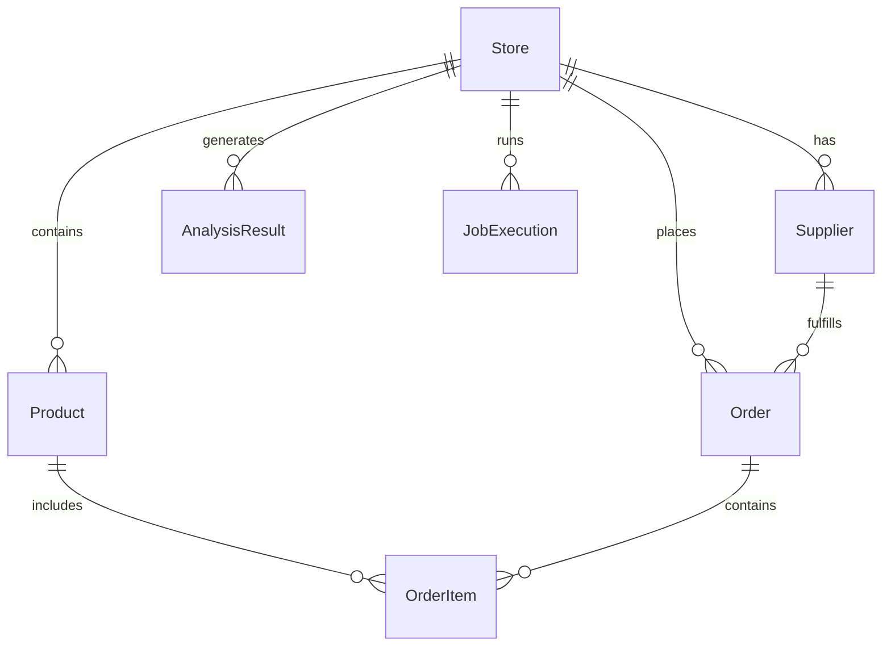

# Technical Context: SKU Sight

## Technologies Used

### Frontend
- **React**: Core UI library for building component-based interfaces
- **Remix**: Framework for server-side rendering and routing
- **Shopify Polaris**: Design system for consistent Shopify-like UI
- **App Bridge**: Essential library for embedded app integration with Shopify Admin
  - Handles navigation within Shopify Admin
  - Provides UI components (modals, toasts, etc.)
  - Manages authentication and session handling
  - Enables secure communication with Shopify Admin
- **CSS Modules**: For component-scoped styling

### Backend
- **Node.js**: JavaScript runtime for server-side code
- **Remix Server**: Server-side rendering and API handling
- **Prisma ORM**: Database access and management
- **Redis**: Caching and session storage
- **Shopify API**: Integration with Shopify's platform

### Data Storage
- **SQLite**: Development database
- **PostgreSQL/MySQL**: Production database options
- **Redis**: Caching layer and job queue

### DevOps & Infrastructure
- **Docker**: Containerization for consistent environments
- **Shopify CLI**: Development and deployment tooling
- **Vite**: Build tool and development server
- **ESLint/Prettier**: Code quality and formatting

### Testing & Quality
- **Jest**: Unit and integration testing
- **Testing Library**: Component testing utilities
- **Shopify Webhook Testing**: Tools for webhook validation

## Development Setup

### Local Environment
```bash
# Clone repository
git clone [repository-url]

# Install dependencies
npm install

# Set up environment variables
cp .env.example .env

# Generate Prisma client
npm run prisma generate

# Set up development database
npm run setup

# Start development server
npm run dev
```

### Environment Variables
- `SHOPIFY_API_KEY`: Shopify API key for authentication
- `SHOPIFY_API_SECRET`: Shopify API secret for authentication
- `SCOPES`: Required Shopify API scopes
- `HOST`: App host URL
- `REDIS_URL`: Redis connection string
- `DATABASE_URL`: Database connection string

### Development Workflow
1. **Local Development**:
   - Run `npm run dev` to start the development server
   - Access the app through the Shopify CLI tunnel
   - Make changes with hot reloading

2. **Testing**:
   - Write tests for new features
   - Run `npm test` to execute test suite
   - Ensure all tests pass before submitting changes

3. **Deployment**:
   - Run `npm run deploy` to deploy to Shopify
   - Update environment variables if needed
   - Verify deployment in Shopify Partners dashboard

## Technical Constraints

### Shopify Platform Limitations
- **API Rate Limits**: 2 requests per second per API key
- **App Bridge Constraints**: Limited to Shopify Admin context
- **Webhook Delivery**: No guaranteed order or timing
- **Session Timeout**: 24-hour maximum session duration

### Performance Requirements
- **Page Load Time**: Under 2 seconds for initial load
- **API Response Time**: Under 500ms for most operations
- **Concurrent Users**: Support for multiple simultaneous users
- **Data Processing**: Handle stores with up to 100,000 products

### Security Requirements
- **Data Encryption**: All sensitive data must be encrypted
- **Authentication**: OAuth 2.0 flow for all Shopify interactions
- **Authorization**: Proper permission checks for all operations
- **Data Access**: Strict control over data access patterns

### Browser Support
- **Modern Browsers**: Chrome, Firefox, Safari, Edge (latest 2 versions)
- **Mobile Browsers**: iOS Safari, Android Chrome
- **No IE Support**: Internet Explorer is not supported
- **Shopify Admin**: App is designed to run within Shopify Admin iframe

## Dependencies

### Core Dependencies
```json
{
  "dependencies": {
    "@prisma/client": "^6.2.1",
    "@remix-run/dev": "^2.16.1",
    "@remix-run/fs-routes": "^2.16.1",
    "@remix-run/node": "^2.16.1",
    "@remix-run/react": "^2.16.1",
    "@remix-run/serve": "^2.16.1",
    "@shopify/app-bridge-react": "^4.1.6",
    "@shopify/cli": "^3.76.2",
    "@shopify/polaris": "^12.0.0",
    "@shopify/polaris-tokens": "^9.4.2",
    "@shopify/shopify-app-remix": "^3.7.0",
    "@shopify/shopify-app-session-storage-prisma": "^6.0.0",
    "@shopify/theme": "^3.58.2",
    "ioredis": "^5.6.0",
    "isbot": "^5.1.0",
    "prisma": "^6.2.1",
    "react": "^18.2.0",
    "react-dom": "^18.2.0",
    "vite-tsconfig-paths": "^5.0.1"
  }
}
```

### Development Dependencies
```json
{
  "devDependencies": {
    "@remix-run/eslint-config": "^2.16.1",
    "@remix-run/route-config": "^2.16.1",
    "@shopify/api-codegen-preset": "^1.1.1",
    "@types/eslint": "^9.6.1",
    "@types/node": "^22.2.0",
    "@types/react": "^18.2.31",
    "@types/react-dom": "^18.2.14",
    "dotenv": "^16.4.7",
    "eslint": "^8.42.0",
    "eslint-config-prettier": "^10.0.1",
    "prettier": "^3.2.4",
    "typescript": "^5.2.2",
    "vite": "^6.2.2"
  }
}
```

## Database Schema

### Core Tables
- **Session**: Shopify session storage
- **Store**: Store-specific settings and metadata
- **Product**: Product data synchronized from Shopify
- **Order**: Order data for automation
- **Supplier**: Supplier information for ordering
- **AnalysisResult**: Cached analysis results
- **JobExecution**: Background job tracking

### Key Relationships


## API Integration

### App Bridge Integration
- **Authentication**: Secure OAuth token management
- **Navigation**: Handling navigation within Shopify Admin
- **UI Integration**: Native-feeling UI components
- **Context**: Access to shop and user information
- **Session Management**: Maintaining authenticated sessions

### Shopify GraphQL API
- Product management
- Order processing
- Inventory tracking
- Store information

### Shopify REST API
- Fallback for operations not available in GraphQL
- Legacy endpoints when needed

### Webhooks
- Product updates
- Inventory changes
- Order creation and updates
- App installation/uninstallation

## Caching Strategy

### Redis Caching
- Session data
- Frequently accessed product information
- Analysis results
- API response caching

### Cache Invalidation
- Time-based expiration
- Webhook-triggered invalidation
- Manual purge options
- Selective invalidation patterns

## Performance Optimization

### Database Optimization
- Indexed queries
- Efficient joins
- Pagination for large datasets
- Query optimization

### Frontend Optimization
- Code splitting
- Lazy loading
- Asset optimization
- Efficient re-rendering

### API Optimization
- Batched requests
- Selective field retrieval
- Parallel processing
- Rate limit management

## Documentation References

For detailed information on the technologies used in this project, refer to the following documentation:

### Shopify
- [App Bridge Documentation](https://shopify.dev/docs/api/app-bridge)
- [Polaris Design System](https://polaris.shopify.com/)
- [Shopify Admin API](https://shopify.dev/docs/api/admin)
- [Embedded App Best Practices](https://shopify.dev/docs/apps/best-practices)

### Frameworks
- [Remix Documentation](https://remix.run/docs/en/main)
- [Shopify Remix Library](https://shopify.dev/docs/api/shopify-app-remix)
- [React Documentation](https://react.dev/)

### Data & Backend
- [Prisma Documentation](https://www.prisma.io/docs)
- [Redis Documentation](https://redis.io/docs/)

For a comprehensive list of all documentation references, see [references.md](./references.md).
